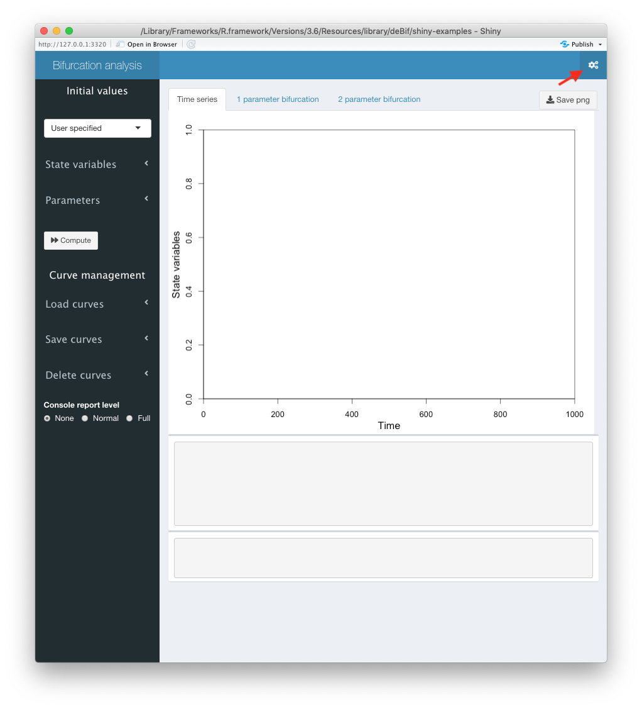
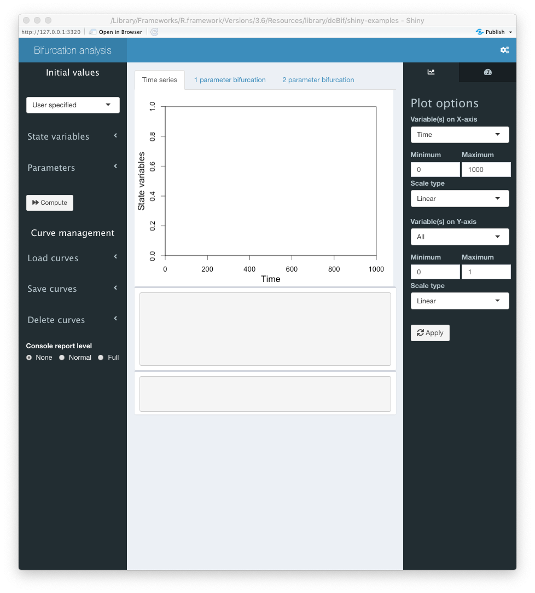

# The `bifurcation()` application

After starting the `bifurcation()` application a new window opens up, which is shown in Figure \@ref(fig:bifstart). The application contains a side bar at the left, which is used for specifying initial values for the state variables and parameters and for loading, saving and deleting curves that are computed with the `bifurcation()` application. The remainder of the window consists of 3 tab sheets, called `Time series`, `1 parameter bifurcation` and `2 parameter bifurcation`. Switching between these tabs is achieved by clicking on the appropriate tab name. Each tab sheet includes a plot frame and 2 frames in which progress messages as well as errors will be reported. Notice that the plot frame differs between the 3 tab sheets. 

```{r bifstart, fig.cap="Starting view of the `bifurcation()` application. The red arrow indicates the gears icon that opens up the right sidebar."}

```

## Customizing the time series plot

Curves of the model dynamics that will be shown in the time series plot include as variables the time and the values of all state variables defined in the model. By default the plot frame on the `Time series` tab sheet shows the independent time variable on the *x*-axis and the values of all state variables on the *y*-axis with the *x*-axis ranging from 0 to 1000 and the *y*-axis from 0 to 1. These default settings can be customized using the right sidebar, which can be shown by pressing the gears icon in the right-top corner of the application window (see Figure \@ref(fig:bifstart)).

```{r biftsplot, fig.cap="`bifurcation()` application window with right sidebar extended allowing for customizing the time series plot."}

```

Figure \@ref(fig:biftsplot) shows the `bifurcation()` application window with the right sidebar visible. The dropdown menus allow for selecting which variables are used as *x*- and *y*-coordinates in the time series plots. Only a single variable can be selected as *x*-coordinate, either the time variable or one of the state variables of the model. As *y*-coordinate it is possible to select all state variables, in which case as many curves will be plotted as there are state variables defined in the model. All state variables will then be plotted using the same *y*-axis at the left of the plot. The boxes and dropdown menus in the right sidebar allow for customization of the minimum and maximum values on the *x*- and *y*-axis as well as whether a linear of logarithmic axis scale should be used. 

Alternatively, when a single state variable is selected as *y*-coordinate the right sidebar extends and offers the possibility to add a second *y*-axis on the right-hand side of the plot, on which another state variable can be plotted. If a second state variable is selected to be plotted on the second *y*-axis at the right-hand side of the plot the right sidebar panel extends even further to allow for specification of the minimum and maximum value and the scale type to use on this second *y*-axis. Figure \ref@(fig:biftsrightsidebar) shows the 3 different configurations of the right sidebar. Which one is shown depends on whether a single or all state variables are plotted on the primary, left *y*-axis and on whether or not a second state variable is selected to be shown on the secondary, right *y*-axis.

```{r biftsrightsidebar, out.width = "70%", fig.cap="The 3 different configurations of the right sidebar of the `bifurcation()` application window depending on which state variables are selected to be shown on the primary and secondary *y*-axis."}
knitr::include_graphics("images/bifurcation-TSrightsidebar.png")
```

If single state variables are selected to be plotted on both the primary and the secondary *y*-axis, the right side bar also provides the option to plot the time series curve in a 3-dimensional perspective plot. The viewing angle of such 3-dimensional graphs can be adjusted with the slider that shown at the bottom of the right sidebar, just above the apply button.

> After adjusting the plot parameters in the right sidebar the `Apply` button has to be pressed to finalize the changes made. Subsequently, the gears icon at the right-top corner of the application window can be pressed to hide the right sidebar again.

## Calculating time series

Clicking on the `State variables` menu title in the left sidebar (see Figure \@ref(fig:bifstart)) expands a submenu with current values of the state variables in the model. Similarly, clicking on the `Parameters` menu title expands a similar submenu showing the current values of the parameters. New initial values for the state variables and parameters can be enetered using these two submenus. Once the initial values have been appropriately adapted, the  time series of the model dynamics can be calculated by pressing the `Compute` button below the `State variables` and `Parameters` submenus in the left sidebar.
